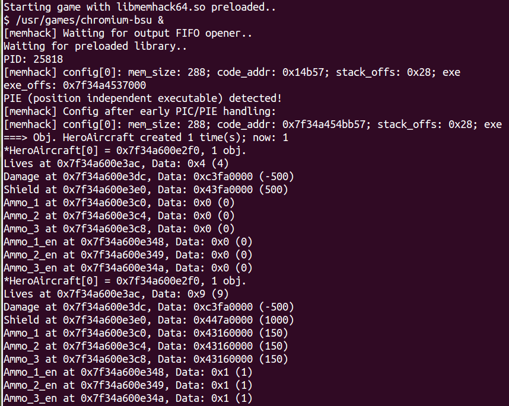
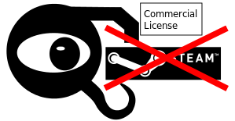

## ugtrain - Universal Game Trainer

The ugtrain (say You-Gee-train) is an advanced free and universal game trainer for
the command line under GPLv3 license. It is a research project and a tool for
advanced users who want latest and really working Linux game cheating methods
at the cost of no GUI and limited usability.

The **dynamic memory support** sets ugtrain apart. An integrated preloader,
a memory discovery, and a memory hacking library are included for this.
It uses one simple **config file per game** which can be exchanged
with others. **Example configs** for games which allow cheating are included.
These also come with **automatic adaptation** for dynamic memory so that you can
use them right away on your system after executing it.

Furthermore, security measures like **ASLR/PIC/PIE are bypassed**. Together with
**universal checks**, reliable and stable static memory cheating is provided.
Ugtrain works with most C/C++ games on Linux this way. With **scanmem** it
integrates the best memory search on Linux and there is even **no need for root
privileges**.

What a **game trainer** is:  
http://en.wikipedia.org/wiki/Trainer_%28games%29

For **further documentation** see:

* [Questions and Answers](README_qanda.md)
* [Static Memory Cheating Documentation](doc/ugtrain-statmem.md)
* [Dynamic Memory Cheating Documentation](doc/ugtrain-dynmem.md)
* [Config Syntax Description](examples/README.md)
* [Development TODOs](TODO)

## Logo and Screenshots
<table><tr><td>
</td><td>
</td></tr></table>

## Videos of Examples

**Chromium B.S.U.**  
https://www.youtube.com/watch?v=mTpC30tSMqU

**Warzone 2100**  
https://www.youtube.com/watch?v=1GcppQNpdTc

## Legal Warning

Don't use game trainers or any other cheating software for commercial
closed-source, multi-player or online games! Please don't use ugtrain
for that! You may violate copyright and other laws by doing so. Recording
videos of doing so makes the situation even worse in terms of law. Please
always read the end user license agreement (EULA) of the game to be very
sure if you are really allowed to do so or not! If in doubt, use games
with official FOSS licenses (like GPLv2) in single-player mode only.

Especially don't cheat at Steam! They send out crash dumps with delicate
information included. We can't accept that you impair our reputation by
sending dumps with ugtrain parts visible to them.

## Linux Distribution Packages:

Arch: https://aur.archlinux.org/packages/ugtrain-git/

Debian: https://sourceforge.net/projects/ugtrain/files/

Gentoo: https://github.com/elitak/ugtrain-overlay

Ubuntu: https://launchpad.net/~s-parschauer/+archive/ubuntu/game-cheating

## How to Build and Install

Make sure that the following packages are installed on your system:  
`autotools-dev`, `autoconf`, `automake`, `g++`, `libtoolize`, and `libtool`

1. Generate the missing autotools files:  
`./autogen.sh`

2. Configure the build to generate the Makefiles:  
`./configure --prefix=/usr`

3. Build the ugtrain binaries:  
`make`

4. install ugtrain, tools and the libs to /usr:  
`sudo make install`

5. regenerate the ld.so cache (see `man ld.so`):  
`sudo ldconfig -v`

`objdump` (package `binutils`) and `scanmem` should be installed as well.

Special configure options:  
Compile hooking libs as 32 and 64 bit (EXPERIMENTAL):  
`./configure --prefix=/usr --enable-multilib`  
Compile hooking libs with glib2 function hooking (EXPERIMENTAL):  
`./configure --prefix=/usr --enable-glib`  
Compile without `/proc/$pid/mem` support:  
`./configure --prefix=/usr --disable-procmem`

## How to Use

Use the compiled tool as follows:  
`ugtrain [options] <config>[.conf]`

This searches in the current working directory for the `<config>.conf`. 
If it can't find it there, then it tries `~/.ugtrain/<config>.conf`.

For details use:  
`ugtrain --help`

Do e.g. the following:  
`ugtrain -P examples/chromium-bsu64`

This parses the chromium-bsu64.conf from the examples, runs the
game with libmemhack64.so preloaded and starts freezing the configured
values. In [examples/README.md](examples/README.md) the config syntax
is described.

If it asks you for automatic adaptation, then you should accept. The
adaptation can be triggered explicitly as well:  
`ugtrain -A examples/chromium-bsu64`

## Current Limitations

**CPU Architecture**

* PCs: tested on x86 and x86\_64 only
* embedded: tested on Raspberry Pi only

**Operating System**

* Linux only

**Configs**

* no config editor - use your favorite text editor
* can't be reloaded when the game is already running
* can't implement adaptation for all of them (too much efforts)

**Static Memory**

* no adaptation yet

**Dynamic Memory**

* growing of objects/structures experimental, no documentation yet
* no adaptation for allocations within a library (PIC) yet
* disassembly within discovery and adaptation for x86 and x86\_64 only
* doesn't work with WINE yet

**Pointer Following**

* preferred from dynamic memory and unpreferred from static memory
* limited discovery features (tool `ugptrfind` or `gdb` with `gef`)

**Compilation**

* 32 bit, \*64\*, and s390x only
* tested with GCC g++ only

**GUI**

* can't serve as a backend yet
* runs in batch mode only - ncurses interface required
* GUI development rejected

Memory scanning integration needed, not enough development resources,
no contributions, and no personal need.

**Testing**

* testing is limited to manual tests so far
* tests are mostly based on Debian/Ubuntu/openSUSE distributions
